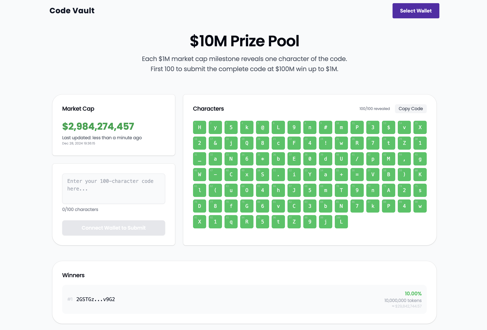

# Code Vault - A Solana Game

<p align="center">
  
</p>

> This is a fun personal project that I'm making public. I welcome any help or suggestions, especially with the smart contract implementation.

A unique token-based game where market milestones unlock a secret redemption code. First 100 to crack it win!

## 🎮 How Does the Game Work?

Every time the token reaches a 1M milestone, one character of a redemption code is revealed. The complete code will be revealed when we reach 100M tokens. The first 100 people to submit the correct code win a share of the prize pool. The entire process is automated through smart contracts - no human intervention.

## 🏆 Prize Distribution

From the total supply of 1B tokens:

- **88% (880M)** goes to Trading and Liquidity
- **10% (100M)** forms the Prize Pool:
  - 1st Place: 10M tokens (10%)
  - 2nd Place: 7M tokens (7%)
  - 3rd Place: 5M tokens (5%)
  - 4th-10th: 2M each (14% total)
  - 11th-30th: 1M each (20% total)
  - 31st-100th: 630K each (44% total)
- **2% (20M)** allocated for Development

## 🔐 Security

The game is built with security as a top priority:

- No special privileges or owner controls
- Redemption code protected with secure hashing
- Fully automated distribution mechanism
- All transactions and actions are verifiable

## 💎 Rewards

When you submit the correct code and are among the first 100 winners, your prize tokens will be automatically sent to your wallet. No claiming process needed - it's all automated!

## 🚧 Project Status: Work in Progress

This project is currently under active development. While the basic infrastructure is in place, there are several areas where contributions would be welcome.

### What's Working ✅

- **Backend (NestJS)**

  - API infrastructure
  - Game state management
  - WebSocket setup for real-time updates

- **Frontend (Next.js)**
  - UI implementation
  - Real-time game state updates via WebSocket

### Areas Needing Help 🤝

- **Smart Contract Development**
  - A draft smart contract is available in `packages/contracts/code_vault` but needs to be completed
  - The contract should handle:
    - Token distribution to winners (10% of total supply split among 100 winners)
    - Development fund allocation (2% of total supply)
    - Integration with the existing backend
  - Looking for help with:
    - Completing the implementation
    - Testing and security auditing
    - Proper error handling and edge cases
    - Gas optimization

## 🏗️ Tech Stack

- **Frontend**: Next.js, TypeScript
- **Backend**: NestJS, TypeScript
- **Database**: PostgreSQL
- **Caching**: Redis
- **Package Manager**: pnpm

## 🚀 Getting Started

### Prerequisites

- Node.js (v16+)
- pnpm
- PostgreSQL
- Redis

### Installation

1. Clone the repository:

```bash
git clone git@github.com:jcoulaud/code-vault.git
cd code-vault
```

2. Install dependencies:

```bash
pnpm install
```

3. Set up environment variables:

```bash
# Copy example env files
cp apps/api/.env.example apps/api/.env
cp apps/web/.env.example apps/web/.env
```

4. Start the development environment:

```bash
# Start the backend
cd apps/api
pnpm dev

# Start the frontend
cd apps/web
pnpm dev
```

## 🤝 How to Contribute

We welcome contributions! Here are the main areas where help is needed:

1. **Smart Contract Development**

   - Implementing the token distribution mechanism
   - Writing comprehensive tests
   - Security improvements

2. **Frontend Enhancements**

   - UI/UX improvements
   - Additional features implementation
   - Performance optimizations

3. **Backend Development**
   - API endpoint expansion
   - Performance optimizations
   - Additional test coverage

## 📝 Project Structure

```
code-vault/
├── apps/
│   ├── api/          # NestJS backend
│   └── web/          # Next.js frontend
└── packages/
    └── config/       # Shared configuration
```

## 🔒 Security

- Environment variables should never be committed
- Use `.env.example` files as templates
- Follow security best practices for API keys and sensitive data

## 📜 License

This project is licensed under the MIT License - see the [LICENSE](LICENSE) file for details.

## 🤝 Contact

For questions or collaboration, please [open an issue](https://github.com/jcoulaud/code-vault/issues).

---

⭐️ If you find this project interesting, please consider giving it a star!
